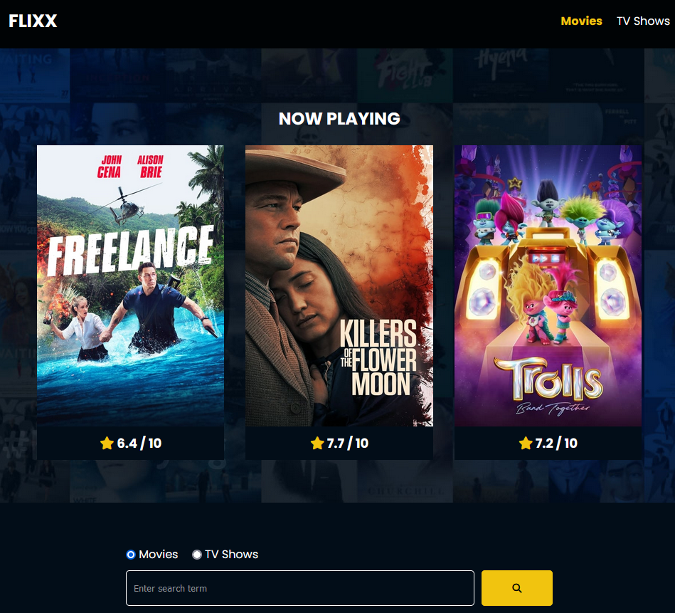

## Flixx App

This app displays movie and tv information.  It is searchable.  The project from the [Modern JavaScript from The Beginning 2.0 course](https://www.traversymedia.com/modern-javascript-2-0).

Coded in vanilla JavaScript.  Data is from The [Movie Database API](https://developer.themoviedb.org/docs).
  

**Flixx App screenshot:**

